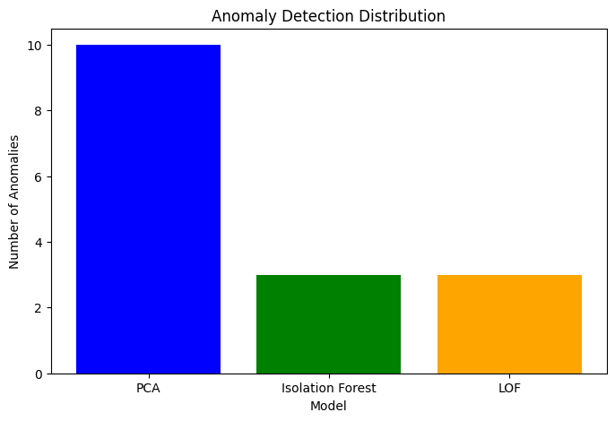

# An Anomaly Detection Pipeline for PELL-IP Public Street Lighting Data

## Overview

This project is part of a Master’s thesis and focuses on building a production-ready, scalable pipeline for unsupervised anomaly detection in smart meter energy consumption data. Using PySpark and unsupervised learning models, the system identifies anomalous Points of Delivery (PODIDs) based on their monthly consumption behavior. The pipeline reads and processes raw JSON data, aggregates meaningful features, applies multiple anomaly detection techniques, and combines results via an ensemble approach—emphasizing performance, scalability, and production feasibility.

---

## Dataset Description

The dataset is provided by [**ENEA**](https://www.pell.enea.it) and consists of multiple structured JSON files containing energy consumption data collected from smart meters. Each entry includes geographical, temporal, and electrical measurements.

| Field Name              | Type     | Description                                                             |
|------------------------|----------|-------------------------------------------------------------------------|
| `height`               | Double   | Height (in meters) of the measurement device.                          |
| `start_ts`             | Timestamp| Start timestamp of the measurement period.                             |
| `end_ts`               | Timestamp| End timestamp of the measurement period.                               |
| `ElectricPanelID`      | String   | Unique identifier for the electric panel.                              |
| `Line1Current`         | Double   | Electric current on Line 1 (in amperes).                               |
| `Line2Current`         | Double   | Electric current on Line 2 (in amperes).                               |
| `Line3Current`         | Double   | Electric current on Line 3 (in amperes).                               |
| `PODID`                | String   | Unique identifier for the Point of Delivery (POD).                     |
| `Phase1ActivePower`    | Double   | Active power on Phase 1 (in kilowatts).                                |
| `Phase1ApparentPower`  | Double   | Apparent power on Phase 1 (in kilovolt-amperes).                       |
| `Phase1PowerFactor`    | Double   | Power factor on Phase 1 (real power to apparent power ratio).          |
| `Phase1ReactivePower`  | Double   | Reactive power on Phase 1 (in kilovars).                               |
| `Phase1Voltage`        | Double   | Voltage on Phase 1 (in volts).                                         |
| `Phase2ActivePower`    | Double   | Active power on Phase 2 (in kilowatts).                                |
| `Phase2ApparentPower`  | Double   | Apparent power on Phase 2 (in kilovolt-amperes).                       |
| `Phase2PowerFactor`    | Double   | Power factor on Phase 2.                                               |
| `Phase2ReactivePower`  | Double   | Reactive power on Phase 2 (in kilovars).                               |
| `Phase2Voltage`        | Double   | Voltage on Phase 2 (in volts).                                         |
| `Phase3ActivePower`    | Double   | Active power on Phase 3 (in kilowatts).                                |
| `Phase3ApparentPower`  | Double   | Apparent power on Phase 3 (in kilovolt-amperes).                       |
| `Phase3PowerFactor`    | Double   | Power factor on Phase 3.                                               |
| `Phase3ReactivePower`  | Double   | Reactive power on Phase 3 (in kilovars).                               |
| `Phase3Voltage`        | Double   | Voltage on Phase 3 (in volts).                                         |
| `TotalActiveEnergy`    | Double   | Total energy consumption during the period (in kWh).                   |
| `TotalActivePower`     | Double   | Total active power (in kilowatts).                                     |
| `TotalApparentPower`   | Double   | Total apparent power (in kilovolt-amperes).                            |
| `TotalReactiveEnergy`  | Double   | Total reactive energy during the period (in kvarh).                    |
| `TotalReactivePower`   | Double   | Total reactive power (in kilovars).                                    |
| `TownCode`             | String   | Code representing the location of the measurement.                     |

---

## Approach & Methodology

1. **Data Ingestion & Parsing**  
   - Parses JSON files containing raw smart meter data.
   - Normalizes nested structures into flat tabular format using Python.

2. **Data Preprocessing & Aggregation**  
   - Cleans missing/null values, converts types, and handles timestamps.
   - Monthly aggregation of key features grouped by `PODID`.

3. **Feature Engineering**  
   - Extracts statistical summaries (mean,sum).
   - Filters only complete `PODID`s with data in required months.

4. **Anomaly Detection Models**

   This project adopts a multi-model approach to unsupervised anomaly detection, leveraging different perspectives on what constitutes an "anomaly" in energy consumption patterns.

   - **PCA (Principal Component Analysis):**  
     PCA is used for dimensionality reduction by projecting high-dimensional data onto a lower-dimensional subspace. Anomalies are identified based on high reconstruction error—data points that cannot be well-represented in the reduced space. This approach is especially effective when the original features are correlated and high-dimensional.

   - **Isolation Forest:**  
     A tree-based ensemble model that isolates anomalies by recursively partitioning the data using randomly selected features and split values. Anomalous points are typically isolated in fewer steps, making them easily distinguishable.  
     ➤ *GridSearchCV* was utilized to automatically optimize key hyperparameters, such as the number of estimators and contamination rate. This helped tailor the model to the distribution and structure of the aggregated monthly energy features, improving both accuracy and generalization.

   - **Local Outlier Factor (LOF):**  
     LOF is a density-based technique that identifies anomalies by evaluating how isolated a point is with respect to the local density of its neighborhood. It is particularly effective for detecting context-dependent or localized anomalies that might be missed by global models.  
     ➤ To ensure optimal performance, *GridSearchCV* was applied to systematically explore different values for `n_neighbors` and contamination levels. This tuning step enhanced the model’s sensitivity to local patterns in energy usage and reduced the risk of misclassification.


5. **Ensemble Detection & Evaluation**  
   - Combines results from all models to enhance robustness.
   - Uses the Silhouette Score to assess the quality of anomaly separation.

6. **Production-ready Pipeline**  
   - Designed as modular scripts and PySpark jobs.
   - Excludes plotting and focuses on identifying and logging anomalous `PODID`s.

---

## Technologies & Tools

This project employs the following technologies and tools:

- **Python**: Core language used for all components.
- **PySpark**: For distributed data processing and pipeline orchestration.
- **Apache Spark**: Back-end engine for scalable data transformations.
- **Apache Hadoop (HDFS)**: Optional distributed storage integration for large-scale deployment.
- **Pandas**: Data manipulation and feature processing in local mode.
- **NumPy**: Numerical operations for ML preprocessing.
- **Scikit-learn**:
  - **PCA**: Dimensionality reduction & anomaly detection.
  - **Isolation Forest**: Tree-based anomaly detection.
  - **Local Outlier Factor**: Density-based anomaly scoring.
  - **Silhouette Score**: Evaluation of anomaly clusters.
- **SQLAlchemy**: Framework for managing database connections and inserting data.
- **MySQL**: Database management system for storing anomaly detection results.
- **VS Code**: IDE for development and debugging.
- **Linux Bash (Ubuntu)**: Environment setup, job management, and exporting environment variables.

---
### Database Integration: MySQL Storage

To ensure the detected anomalies are stored securely for further analysis, the pipeline integrates with a MySQL database. Below are the detailed steps for setting up the database and table:

#### **Step 1: Create a Database**
Run the following commands in your MySQL environment to create the database:
```sql
CREATE DATABASE anomaly_db;
USE anomaly_db;
```

#### **Step 2: Create a Table**
Set up the table structure to store the anomaly results:
```sql
CREATE TABLE anomaly_results (
    id INT AUTO_INCREMENT UNIQUE NOT NULL,
    PODID VARCHAR(255),
    anomaly_pca_label INT,
    anomaly_iso_label INT,
    anomaly_lof_label INT,
    anomaly_ensemble INT,
    insertion_time DATETIME
);
```

#### **Step 3: Configure Environment Variables**
Export the required credentials in your terminal to securely connect the pipeline to the database:
```bash
export MYSQL_USER=root
export MYSQL_PASSWORD=your_password
export MYSQL_DB=anomaly_db
export MYSQL_HOST=localhost
```

#### **Step 4: Pipeline Integration**
- The pipeline filters and processes the results using PySpark and Pandas.
- Data is inserted into the `anomaly_results` table using SQLAlchemy's `to_sql` method for seamless integration.


---

## Project Structure
```java
ENEA-AnomalyDetectionPipeline/
│
├── images/
│
├── data/
│   ├── Menowattge/                     # Files JSON 
│   └── municipalities/
├── scripts/
│   ├── load_data.py             
│   ├── preprocessing.py         
│   ├── anomaly_detection.py     # PCA, Isolation Forest, LOF
│   ├── ensemble.py              
│   
│
├── main.py                     
├── requirements.txt            
└── README.md
```


## Setup & Requirements

Ensure the following are installed in your environment:
- Python: Version 3.10.14 or later.
- Apache Spark: Version 3.3.0.
- Hadoop: Version 3.3.6.
- Required Python libraries:
  - PySpark (pyspark)
  - NumPy (numpy)
  - Pandas (pandas)
  - Scikit-learn (sklearn)
  - SQLAlchemy (sqlalchemy): Database connection and management.
  - PyMySQL (pymysql): Connector for MySQL database interaction.
 

Configure environment variables if needed:
```bash
export JAVA_LIBRARY_PATH=/usr/lib/hadoop/lib/native
```

## Results & Evaluation

The pipeline outputs a labeled dataset with anomaly flags per `PODID`, based on:
- **Individual model scores** (e.g., PCA reconstruction error, LOF score, Isolation depth).
- **Consensus labels** generated by an ensemble voting strategy.
- **Silhouette Score** to assess the separability of detected anomalies from normal patterns.

### Visualizations

Some plots obtained from the pipeline results for the month of January. Including the results of subsequent analyses would provide a better understanding of the models' performance:

<br>

<br>

<br>


### Database Storage:
The processed results are seamlessly stored in a MySQL database for further analysis and long-term storage. This database integration ensures that domain experts can:
- Query and analyze flagged anomalies directly from the database.
- Access timestamped results for tracking and auditing purposes.
- Leverage stored data for additional reporting or visualization tasks.

The database structure includes fields such as `PODID`, anomaly labels from different models, an ensemble label, and an insertion timestamp to maintain comprehensive and organized records.

These results not only identify potential faults, consumption peaks, or data inconsistencies but also provide a scalable and production-ready mechanism for saving and accessing anomaly detection outcomes.

---

## Acknowledgments

I would like to express my deepest gratitude to my professor, [**Prof. Scandurra**](https://unibg.unifind.cineca.it/individual?uri=http%3A%2F%2Firises.unibg.it%2Fresource%2Fperson%2F1502), for her invaluable guidance, insightful feedback, and unwavering support throughout this project. Her expertise and encouragement have been instrumental in shaping the success of this work.

Additionally, I extend my heartfelt thanks to **ENEA (Italian National Agency for New Technologies, Energy and Sustainable Economic Development)** for their collaboration and support. Their expertise and resources have greatly contributed to the development and real-world applicability of this project.

